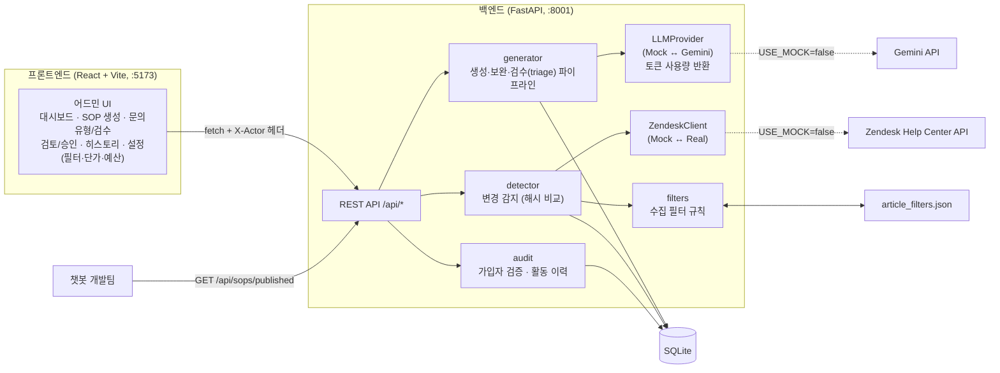
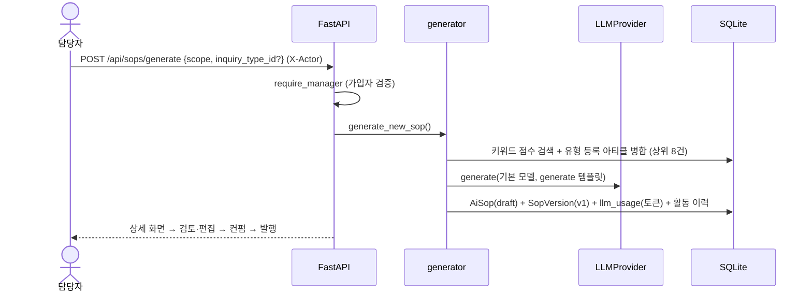
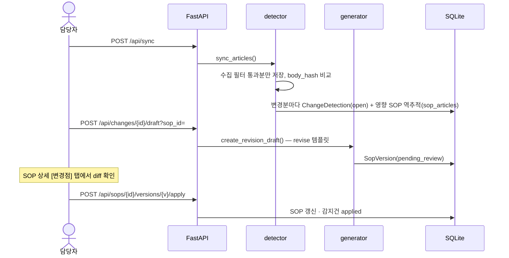
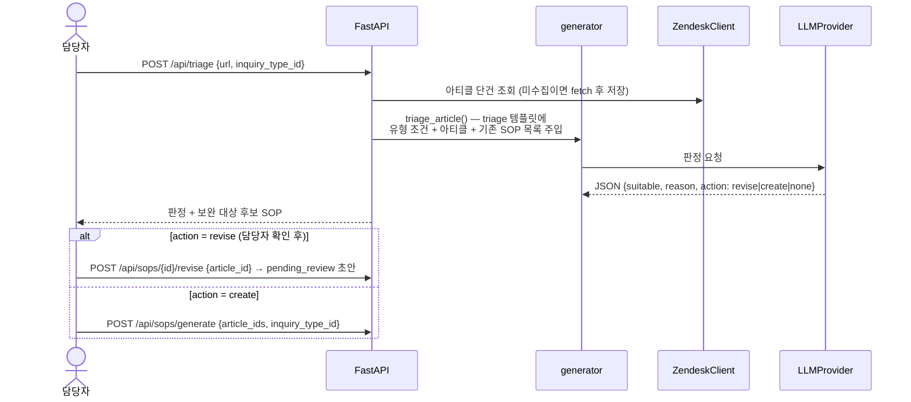
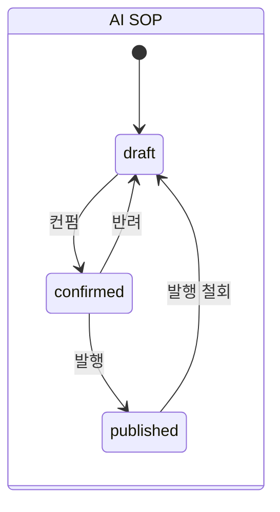
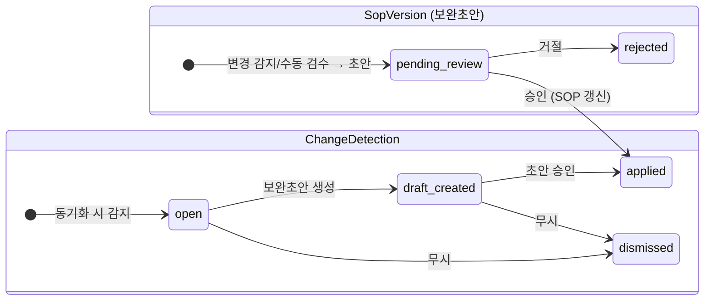

# 아키텍처 개요

AI SOP Studio는 상담사용 Zendesk 헬프센터 아티클을 근거로 **AI 챗봇용 SOP(AI SOP)를 생성 → 검토 → 발행**하는 어드민 툴이다.
어드민이 AI SOP의 단일 저장소이며, 발행된 SOP는 개발팀이 API/JSON으로 가져가 챗봇 프롬프트에 반영한다.

핵심 개념:
- **문의유형(InquiryType)** — 반품/교환/무응답 등 계속 늘어나는 유형. 유형별로 조건 설명과 관련 아티클 링크를 관리하고, SOP가 유형에 연결된다.
- **수집 필터(article_filters.json)** — 동기화 시 제목 키워드 규칙으로 아티클 수집 여부 결정.
- **3종 프롬프트** — generate(신규 생성) / revise(보완) / triage(수동 링크 검수 판단), 모두 운영자가 어드민에서 수정.
- **비용 트래킹** — 모든 LLM 호출의 토큰을 담당자별로 기록, 조회 시점 단가로 USD/KRW 계산, 주간 예산 초과 노티.

## 시스템 구조도



**외부 연동은 전부 인터페이스 뒤에 있다.** `USE_MOCK` 환경변수 하나로 Mock(로컬 개발) ↔ Real(실 환경)을 전환하며, 비즈니스 로직은 어느 쪽인지 알지 못한다.

| 인터페이스 | Mock 구현 | Real 구현 | 위치 |
|---|---|---|---|
| `ZendeskClient` | `seed_data/articles.json` (+`overrides.json` 변경 시뮬레이션) | Help Center API (목록 + 단건 조회) | `backend/app/services/zendesk.py` |
| `LLMProvider` | 규칙 기반 가짜 응답 (보완=diff 조각 치환, 검수=판정 JSON) | google-genai SDK (`usage_metadata`로 토큰 집계) | `backend/app/services/llm.py` |

## 디렉토리 구조

```
sop-admin/
├── backend/
│   ├── article_filters.json   # 수집 필터 규칙 (어드민 편집 가능, 파일 직접 수정도 동작)
│   ├── app/
│   │   ├── main.py            # FastAPI 앱 조립
│   │   ├── config.py          # 환경변수 (USE_MOCK, GEMINI_*, ZENDESK_*, AVAILABLE_MODELS)
│   │   ├── database.py        # SQLAlchemy 엔진/세션
│   │   ├── models.py          # ORM 모델 (docs/REFERENCE.md의 ERD 참고)
│   │   ├── schemas.py         # Pydantic 요청/응답 스키마
│   │   ├── routers/           # HTTP 레이어 (얇게 유지, 로직은 services로)
│   │   │   ├── articles.py    #   동기화 · 아티클 조회/검색
│   │   │   ├── changes.py     #   변경 감지 목록 · 보완초안 · 무시
│   │   │   ├── inquiry.py     #   문의유형 CRUD · 아티클 링크 · 수동 검수(triage)
│   │   │   ├── sops.py        #   SOP CRUD · 생성 · 버전 승인/거절 · 상태 · 테스트 · 발행본
│   │   │   ├── settings.py    #   기본 모델/프롬프트 · 수집 필터 · 템플릿 CRUD
│   │   │   ├── usage.py       #   LLM 사용량 집계 · 모델 단가 · 예산 상태
│   │   │   └── admin.py       #   가입(join) · 담당자 · 활동 이력
│   │   └── services/          # 도메인 로직
│   │       ├── generator.py   #   프롬프트 조립 → LLM 호출(사용량 기록) → SOP/버전 저장, triage 판정
│   │       ├── detector.py    #   해시 비교 변경 감지 (+수집 필터 적용)
│   │       ├── filters.py     #   article_filters.json 로드/저장/판정
│   │       ├── audit.py       #   X-Actor 추출 · require_manager 가드 · 이력 기록
│   │       ├── zendesk.py     #   ZendeskClient (Mock/Real)
│   │       └── llm.py         #   LLMProvider (Mock/Gemini) — LLMResult(text, 토큰) 반환
│   ├── seed_data/articles.json  # 한국어 CS 샘플 아티클 12건
│   └── seed.py                # 초기화/시드/변경 시뮬레이션 CLI
├── frontend/src/
│   ├── api/client.ts          # fetch 래퍼 (X-Actor 자동 첨부) · 가입 계정 저장
│   ├── types.ts               # 백엔드 스키마와 1:1 대응하는 TS 타입
│   ├── App.tsx                # 가입 화면 · 레이아웃 · 예산 초과 노티
│   ├── components/ui.tsx      # StatusBadge · Md · DiffView · TextDiff(lineDiff) · Toast
│   └── pages/                 # Dashboard · SopGenerate · InquiryTypes(유형·검수) · SopList
│                              # · SopDetail · ChangeDetail · History · Settings
└── docs/                      # 이 문서들
```

## 핵심 플로우

### 1. 신규 AI SOP 생성 (원스텝)

담당자는 **타겟 문의 스코프만 입력**한다 (문의유형 선택 시 유형 등록 아티클 우선 참조).
모델/프롬프트는 `app_settings` 기본값이 자동 적용된다.



### 2. 아티클 변경 감지 → 기존 SOP 갱신 (자동 경로)



### 3. 수동 아티클 링크 검수 (자동 감지가 놓친 경우)

LLM은 **판정만** 하고, 실행(보완/신규)은 담당자가 결정한다.



### 4. 발행 → 개발팀 전달

`draft → confirmed → published` 상태 전환 후, `GET /api/sops/published`가 발행본 전체를 구조화 JSON으로 반환한다
(프론트 [발행본 JSON] 다운로드와 동일 데이터). 개발팀은 `content`(markdown)를 챗봇 프롬프트에 반영한다.

## 아티클 수집 필터

`backend/article_filters.json` — 기존 임시 프로세스와 동일 포맷. 동기화 시 **신규 아티클 제목**에 적용:

```
in_scope_prefixes  (접두어 일치 → 무조건 수집, 최우선)
→ exclusion_keywords (포함 → 제외)
→ out_scope_prefixes (접두어 일치 → 제외)
→ 기본 수집
```

어드민 설정 화면(칩 입력 UI, 쉼표/엔터 추가·목록 붙여넣기 지원)과 파일 직접 수정 모두 동일하게 동작한다 (`services/filters.py`).

## LLM 비용 트래킹 · 예산

- 모든 LLM 호출(generate/revise/regenerate/test/triage)의 **토큰 수를 담당자별로 `llm_usage`에 기록** — 서버 배포 시 전원이 공유.
- 금액은 저장하지 않고 조회 시점의 `model_prices` 단가(USD/100만 토큰, 어드민 수정 가능)로 계산 → **단가 수정이 과거분 표시에도 자동 반영**. 원화는 `usd_krw` 환율로 환산.
- 최근 7일 사용액이 `weekly_budget_usd`(기본 $10) 초과 시 상단 바 노티 + 설정 화면 경고.

## 상태 기계





버전 번호는 거절된 버전을 포함한 전체 이력 기준 `max(version)+1`로 채번한다 (`generator.next_version`).

## 담당자(간이 인증)와 감사 이력

- 로그인 없이 **닉네임/팀명 가입**(`POST /api/join`)만으로 담당자가 된다. 프론트는 계정을 localStorage에 저장하고 모든 요청에 `X-Actor: <URL인코딩된 닉네임>` 헤더를 붙인다.
- 변경성 엔드포인트는 전부 `require_manager` 의존성으로 보호된다 — 미가입 요청은 **403**.
- 모든 주요 액션(생성/보완초안/검수/승인/거절/상태변경/수정/동기화/설정·단가·필터 변경/가입)은 `activity_logs`에 기록되고 `/history` 화면에서 담당자별로 조회한다.
- ⚠️ 이는 **신뢰 환경용 간이 방식**이다. 사내 프로덕션 이관 시 SSO 등 실제 인증으로 교체하고 `services/audit.get_actor`만 그 신원으로 바꾸면 된다.

## 프로덕션 이관 시 교체 포인트

| 항목 | MVP | 이관 시 |
|---|---|---|
| DB | SQLite + `create_all` | RDB + 마이그레이션 도구(Alembic 등) |
| 인증 | X-Actor 헤더 + 가입제 | 사내 SSO → `services/audit.get_actor` 교체 |
| Zendesk 페이지네이션 | offset(`next_page`) 전체 fetch | cursor 페이지네이션 + `incremental/articles`(변경분만) 전환 검토 |
| 아티클 검색 | 키워드 점수 + 필터 규칙 | 임베딩/벡터 검색으로 교체 가능 (인터페이스 동일) |
| LLM 호출 | 동기 처리 | 큐/비동기 잡 (생성이 느릴 경우) |
| 동기화 | 수동 버튼 | 스케줄러(cron) 또는 Zendesk webhook |
| 모델 단가 | 어드민 수동 관리 | 필요 시 가격 API/고정 계약 단가 연동 |
