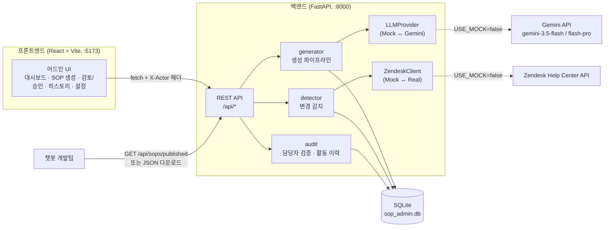
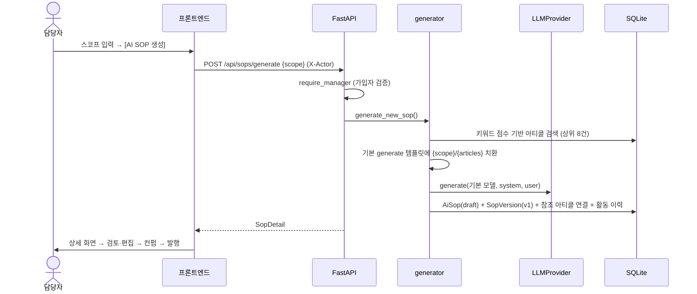
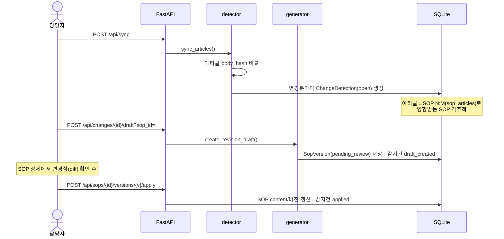
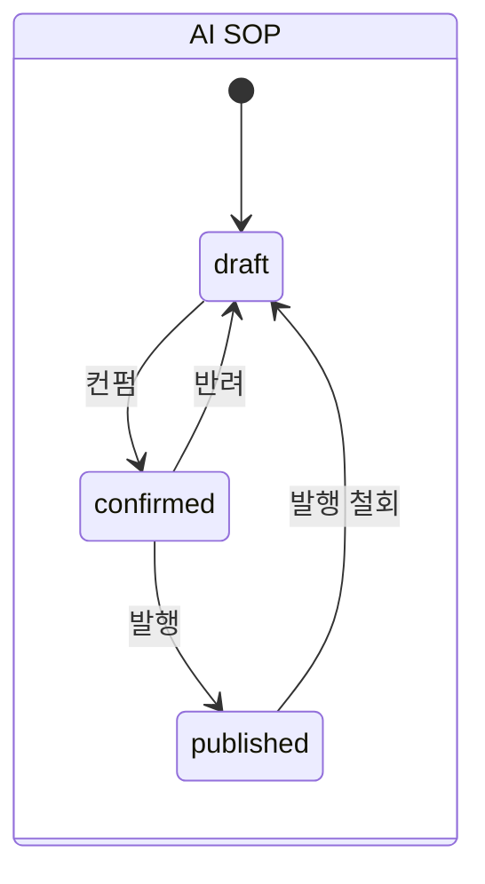
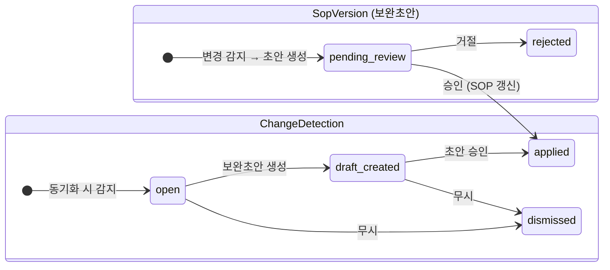

# 아키텍처 개요

AI SOP Studio는 상담사용 Zendesk 헬프센터 아티클을 근거로 **AI 챗봇용 SOP(AI SOP)를 생성 → 검토 → 발행**하는 어드민 툴이다.
어드민이 AI SOP의 단일 저장소이며, 발행된 SOP는 개발팀이 API/JSON으로 가져가 챗봇 프롬프트에 반영한다.

## 시스템 구조도



**외부 연동은 전부 인터페이스 뒤에 있다.** `USE_MOCK` 환경변수 하나로 Mock(로컬 개발) ↔ Real(회사 환경)을 전환하며, 비즈니스 로직은 어느 쪽인지 알지 못한다.

| 인터페이스 | Mock 구현 | Real 구현 | 위치 |
|---|---|---|---|
| `ZendeskClient` | `seed_data/articles.json` (+`overrides.json` 변경 시뮬레이션) | Help Center Articles API | `backend/app/services/zendesk.py` |
| `LLMProvider` | 규칙 기반 가짜 응답 (보완 요청은 diff 조각 치환) | google-genai SDK | `backend/app/services/llm.py` |

## 디렉토리 구조

```
sop-admin/
├── backend/
│   ├── app/
│   │   ├── main.py            # FastAPI 앱 조립 (CORS, 라우터 등록, 테이블 생성)
│   │   ├── config.py          # 환경변수 (USE_MOCK, GEMINI_*, ZENDESK_*)
│   │   ├── database.py        # SQLAlchemy 엔진/세션
│   │   ├── models.py          # ORM 모델 (docs/REFERENCE.md 참고)
│   │   ├── schemas.py         # Pydantic 요청/응답 스키마
│   │   ├── routers/           # HTTP 레이어 (얇게 유지, 로직은 services로)
│   │   │   ├── articles.py    #   동기화 · 아티클 조회/검색
│   │   │   ├── changes.py     #   변경 감지 목록 · 보완초안 생성 · 무시
│   │   │   ├── sops.py        #   SOP CRUD · 생성 · 버전 승인/거절 · 상태 · 테스트 · 발행본
│   │   │   ├── settings.py    #   기본 모델/프롬프트 설정 · 템플릿 CRUD
│   │   │   └── admin.py       #   가입(join) · 담당자 · 활동 이력
│   │   └── services/          # 도메인 로직
│   │       ├── generator.py   #   프롬프트 조립 → LLM 호출 → SOP/버전 저장
│   │       ├── detector.py    #   아티클 해시 비교 → ChangeDetection 생성
│   │       ├── audit.py       #   X-Actor 추출 · require_manager 가드 · 이력 기록
│   │       ├── zendesk.py     #   ZendeskClient (Mock/Real)
│   │       └── llm.py         #   LLMProvider (Mock/Gemini)
│   ├── seed_data/articles.json  # 한국어 CS 샘플 아티클 12건
│   ├── seed.py                # 초기화/시드/변경 시뮬레이션 CLI
│   └── .env.example
├── frontend/src/
│   ├── api/client.ts          # fetch 래퍼 (X-Actor 자동 첨부) · 로컬 계정 저장
│   ├── types.ts               # 백엔드 스키마와 1:1 대응하는 TS 타입
│   ├── App.tsx                # 가입 화면 · 레이아웃 · 라우팅
│   ├── components/ui.tsx      # StatusBadge · Md · DiffView · TextDiff(lineDiff) · Toast
│   └── pages/                 # Dashboard · SopGenerate · SopList · SopDetail · ChangeDetail · History · Settings
└── docs/                      # 이 문서들
```

## 핵심 플로우

### 1. 신규 AI SOP 생성 (원스텝)

담당자는 **타겟 문의 스코프만 입력**한다. 모델/프롬프트는 `app_settings`의 기본값이 자동 적용된다.



### 2. 아티클 변경 감지 → 기존 SOP 갱신



### 3. 발행 → 개발팀 전달

`draft → confirmed → published` 상태 전환 후, `GET /api/sops/published`가 발행본 전체를 구조화 JSON으로 반환한다
(프론트의 [발행본 JSON] 다운로드 버튼과 동일 데이터). 개발팀은 이 JSON의 `content`(markdown)를 챗봇 프롬프트에 반영한다.

## 상태 기계





버전 번호는 거절된 버전을 포함한 전체 이력 기준 `max(version)+1`로 채번한다 (`generator.next_version`).

## 담당자(간이 인증)와 감사 이력

- 로그인 없이 **닉네임/팀명 가입**(`POST /api/join`)만으로 담당자가 된다. 프론트는 계정을 localStorage에 저장하고 모든 요청에 `X-Actor: <URL인코딩된 닉네임>` 헤더를 붙인다.
- 변경성 엔드포인트는 전부 `require_manager` 의존성으로 보호된다 — 미가입 요청은 **403**.
- 모든 주요 액션(생성/보완초안/승인/거절/상태변경/수정/동기화/설정변경/가입)은 `activity_logs`에 "누가/언제/무엇을"로 기록되고 `/history` 화면에서 담당자별로 조회한다.
- ⚠️ 이는 **신뢰 환경용 간이 방식**이다. 사내 프로덕션 이관 시 SSO 등 실제 인증으로 교체하고 `get_actor`만 그 신원으로 바꾸면 된다.

## 프로덕션 이관 시 교체 포인트

| 항목 | MVP | 이관 시 |
|---|---|---|
| DB | SQLite + `create_all` | RDB + 마이그레이션 도구(Alembic 등) |
| 인증 | X-Actor 헤더 + 가입제 | 사내 SSO → `services/audit.get_actor` 교체 |
| 아티클 검색 | 키워드 점수 (`generator.search_articles`) | 임베딩/벡터 검색으로 교체 가능 (인터페이스 동일) |
| LLM 호출 | 동기 처리 | 큐/비동기 잡 (생성이 느릴 경우) |
| 동기화 | 수동 버튼 | 스케줄러(cron) 또는 Zendesk webhook |
