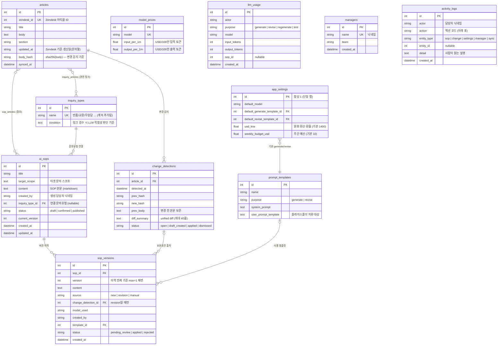

# 개발자 레퍼런스 — 데이터 모델 · 타입 · API

코드만 보고 개발에 반영할 수 있도록 계약(스키마/타입/규약)을 정리한 문서.
원본 소스: `backend/app/models.py`(ORM) · `backend/app/schemas.py`(API 스키마) · `frontend/src/types.ts`(TS 타입).

## 1. 데이터 모델 (ERD)



### 상태 값 (enum은 아니고 문자열 컬럼 — 값은 코드로 강제)

| 대상 | 값 | 전이 규칙 |
|---|---|---|
| `ai_sops.status` | `draft` → `confirmed` → `published` | `routers/sops.py`의 `VALID_STATUS_FLOW`. `confirmed→draft`(반려), `published→draft`(발행 철회) 허용 |
| `sop_versions.status` | `pending_review` / `applied` / `rejected` | pending에서만 apply/reject/수정 가능 |
| `sop_versions.source` | `new`(생성·재생성) / `revision`(변경 감지 보완) / `manual`(직접 수정) | |
| `change_detections.status` | `open` → `draft_created` → `applied`, 또는 `dismissed` | 초안 승인 시 자동 `applied` |

### activity_logs.action 코드

`sop_created` `sop_regenerated` `draft_created` `version_applied` `version_rejected`
`status_changed` `content_edited` `change_dismissed` `sync_run` `settings_updated` `prompt_updated` `member_joined` `price_updated`

### LLM 비용 계산 규칙

- `llm_usage`에는 **토큰 수만 저장**하고 금액은 저장하지 않는다. 비용은 조회 시점에
  `input_tokens/1M × input_per_1m + output_tokens/1M × output_per_1m`로 계산 →
  **어드민에서 단가를 수정하면 과거 사용분 표시 금액에도 자동 반영**된다.
- 원화는 `app_settings.usd_krw` 환율로 환산(기본 1,400).
- 주간(최근 7일 rolling) 사용액이 `weekly_budget_usd`(기본 $10)를 넘으면 `over_budget=true` → UI 상단에 노티.
- 토큰 수 출처: Gemini는 `usage_metadata`(prompt/candidates token count), mock은 글자 수 기반 추정치.

## 2. 프롬프트 템플릿 계약

`prompt_templates.user_prompt_template` 안의 플레이스홀더를 `generator._fill()`이 단순 문자열 치환한다.

프롬프트 용도(purpose)는 3종: **generate**(신규 생성) / **revise**(보완) / **triage**(수동 링크 검수 판단).

| 플레이스홀더 | 주입 값 | 사용 용도 |
|---|---|---|
| `{scope}` | 담당자가 입력한 타겟 문의 스코프 | generate / revise |
| `{articles}` | 참조 아티클 블록 (제목·섹션·Zendesk ID·본문 4,000자 제한, `---` 구분). 변경 감지 revise에서는 끝에 `[변경 diff]` 첨부 | 공통 |
| `{current_sop}` | 기존 SOP 본문 | revise 전용 |
| `{inquiry_type}` / `{condition}` | 문의유형명 / 유형 조건 설명 | triage 전용 |
| `{existing_sops}` | 해당 유형의 기존 SOP 목록 (없으면 `(기존 SOP 없음)`) | triage 전용 |

triage 프롬프트는 반드시 `{"suitable": bool, "reason": str, "action": "revise"|"create"|"none"}` JSON 하나를 출력해야 하며,
백엔드가 첫 `{`~마지막 `}` 구간을 파싱한다 (파싱 실패 시 suitable=false 처리). mock 분기 마커: `[판단 요청]`.

### 아티클 수집 필터 (`backend/article_filters.json`)

동기화 시 **신규 아티클**의 제목으로 수집 여부 결정 (기존 임시 프로세스와 동일 포맷, `services/filters.py`):
`in_scope_prefixes`(접두어 일치 시 무조건 수집, 최우선) → `exclusion_keywords`(포함 시 제외) → `out_scope_prefixes`(접두어 일치 시 제외) → 기본 수집.
어드민 설정 화면(GET/PUT `/api/filters`)과 파일 직접 수정 모두 지원.

LLM 호출 시그니처: `LLMProvider.generate(model, system_prompt, user_prompt) -> str` (반환값 = SOP markdown 전문).

## 3. 인증/감사 규약

- 프론트는 모든 요청에 `X-Actor: encodeURIComponent(닉네임)` 헤더를 자동 첨부한다 (`frontend/src/api/client.ts`).
- 읽기 API는 익명 허용. **변경성 API는 `require_manager`** — `managers`에 없는 닉네임이면 `403 {"detail": "가입된 담당자만 수행할 수 있습니다..."}`.
- 에러 응답은 FastAPI 표준 `{"detail": string}`. 프론트 fetch 래퍼가 `detail`을 Error message로 던진다.

## 4. API 레퍼런스

Base URL: `http://localhost:8000`. 🔒 = `require_manager` (가입 필요).

### 가입/담당자/이력

| Method | Path | 요청 | 응답 |
|---|---|---|---|
| POST | `/api/join` | `{name, team?}` | `Manager` — 동일 닉네임 존재 시 그 계정 반환(팀명 갱신) |
| GET | `/api/managers` | | `Manager[]` |
| DELETE | `/api/managers/{id}` | | `{ok}` — 활동 이력은 보존 |
| GET | `/api/activity` | query: `entity_type?` `entity_id?` `actor?` `limit?(≤300)` | `Activity[]` 최신순 |

### 아티클/동기화

| Method | Path | 요청 | 응답 |
|---|---|---|---|
| POST | `/api/sync` | | `{synced, created, updated, new_detections}` — Zendesk fetch + 해시 비교 + 감지 생성 |
| GET | `/api/articles` | query: `query?`(키워드 검색, 없으면 전체) | `Article[]` (body 제외) |
| GET | `/api/articles/{id}` | | `Article` (body 포함) |

### 문의유형 · 수동 링크 검수

| Method | Path | 요청 | 응답 |
|---|---|---|---|
| GET | `/api/inquiry-types` | | `InquiryType[]` — 관련 아티클, SOP 수 포함 |
| POST 🔒 | `/api/inquiry-types` | `{name, condition}` | `InquiryType` |
| PUT 🔒 | `/api/inquiry-types/{id}` | `{name, condition}` | `InquiryType` |
| POST 🔒 | `/api/inquiry-types/{id}/articles` | `{url}` — Zendesk URL/ID, 미수집 아티클이면 fetch 후 저장 | `InquiryType` |
| DELETE 🔒 | `/api/inquiry-types/{id}/articles/{article_id}` | | `InquiryType` |
| POST 🔒 | `/api/triage` | `{url, inquiry_type_id}` | `{article, suitable, reason, action, candidate_sops}` — LLM 판정만 하고 실행은 담당자가 결정 |
| GET / PUT | `/api/filters` | PUT: `{in_scope_prefixes, exclusion_keywords, out_scope_prefixes}` | 수집 필터 (article_filters.json) |

### 변경 감지

| Method | Path | 요청 | 응답 |
|---|---|---|---|
| GET | `/api/changes` | query: `status?` | `ChangeDetection[]` — `article`, `affected_sops`(해당 아티클 참조 SOP) 포함 |
| GET | `/api/changes/{id}` | | `ChangeDetection` |
| POST 🔒 | `/api/changes/{id}/draft?sop_id=` | | `SopVersion(pending_review)` — 보완초안 생성 |
| POST 🔒 | `/api/changes/{id}/dismiss` | | `ChangeDetection` |

### AI SOP

| Method | Path | 요청 | 응답 |
|---|---|---|---|
| GET | `/api/sops` | query: `status?` | `SopSummary[]` — `has_pending`, `pending_since`(검토 대기 초안 생성 일시) 포함 |
| GET | `/api/sops/published` | | **개발팀 전달용** `PublishedSop[]` |
| POST 🔒 | `/api/sops/generate` | `{scope, article_ids?, inquiry_type_id?}` — `article_ids` 생략 시 자동 검색(+유형 등록 아티클 우선) | `SopDetail` (draft) |
| POST 🔒 | `/api/sops/{id}/revise` | `{article_id}` — 수동 검수 확정분으로 보완 초안 생성 (변경 감지 없이) | `SopVersion(pending_review)` |
| GET | `/api/sops/{id}` | | `SopDetail` — `articles`, `versions` 포함 |
| PATCH 🔒 | `/api/sops/{id}` | `{title?, content?, target_scope?}` — content 변경 시 manual 새 버전 | `SopDetail` |
| POST 🔒 | `/api/sops/{id}/status` | `{status}` — 전이 규칙 위반 시 400 | `SopDetail` |
| POST 🔒 | `/api/sops/{id}/regenerate` | `{article_ids}` — draft 상태에서만 | `SopDetail` |
| POST 🔒 | `/api/sops/{id}/versions/{v}/apply` | | `SopDetail` — SOP 갱신 + 연결 감지건 applied |
| POST 🔒 | `/api/sops/{id}/versions/{v}/reject` | | `SopVersion` |
| PATCH 🔒 | `/api/sops/{id}/versions/{v}` | `{content}` — pending 초안 수정 | `SopVersion` |
| POST | `/api/sops/{id}/test` | `{question}` | `{question, answer, model_used}` — SOP를 시스템 프롬프트로 챗봇 시뮬레이션 |

### 사용량/비용

| Method | Path | 요청 | 응답 |
|---|---|---|---|
| GET | `/api/usage` | | `UsageSummary` — 전체/주간 USD·KRW, `by_actor`(담당자별), `by_model`, `recent`(최근 20건), `over_budget` |
| GET | `/api/usage/status` | | `{week_usd, weekly_budget_usd, over_budget}` — 상단 노티용 경량 조회 |
| GET | `/api/prices` | | `ModelPrice[]` |
| PUT | `/api/prices/{model}` | `{input_per_1m, output_per_1m}` (USD/100만 토큰) | `ModelPrice` — 이후 모든 비용 표시에 즉시 반영 |

### 설정

| Method | Path | 요청 | 응답 |
|---|---|---|---|
| GET | `/api/models` | | `{models: string[], use_mock: bool}` |
| GET / PUT | `/api/settings` | PUT: `{default_model?, default_generate_template_id?, default_revise_template_id?, usd_krw?, weekly_budget_usd?}` | `Settings` |
| GET / POST | `/api/prompts` | POST: `{name, purpose, system_prompt, user_prompt_template}` | `PromptTemplate` |
| PUT | `/api/prompts/{id}` | 위와 동일 | `PromptTemplate` |

### 발행본 JSON 스키마 (`GET /api/sops/published`)

```jsonc
[
  {
    "id": 1,
    "title": "반품 신청 및 배송비 안내",
    "target_scope": "반품 신청 방법, 반품 가능 기간, 반품 배송비 문의",
    "content": "# AI SOP: ...",          // markdown 전문 — 챗봇 프롬프트 반영 대상
    "version": 3,
    "updated_at": "2026-07-09T12:00:00",
    "source_articles": [
      { "zendesk_id": 90003, "title": "반품 신청 절차", "section": "반품/교환" }
    ]
  }
]
```

## 5. 프론트엔드 타입 (`frontend/src/types.ts`)

백엔드 응답 스키마와 1:1 대응. 필드 추가 시 **schemas.py와 types.ts를 함께** 수정할 것.

```typescript
interface Article {
  id: number; zendesk_id: number; title: string; section: string;
  updated_at: string; synced_at: string;
  body?: string;                     // 상세 조회에서만 포함
}

interface SopSummary {
  id: number; title: string; target_scope: string;
  status: "draft" | "confirmed" | "published";
  current_version: number; created_by: string;
  created_at: string; updated_at: string;
  has_pending: boolean;              // 검토 대기 보완초안 존재
  pending_since: string | null;      // 그 초안의 생성 일시
}

interface SopDetail extends SopSummary {
  content: string;                   // markdown
  articles: Article[];               // 참조 아티클
  versions: SopVersion[];            // 버전 오름차순
}

interface SopVersion {
  id: number; sop_id: number; version: number; content: string;
  source: "new" | "revision" | "manual";
  change_detection_id: number | null;
  model_used: string; created_by: string;
  status: "pending_review" | "applied" | "rejected";
  created_at: string;
}

interface ChangeDetection {
  id: number; article_id: number; detected_at: string;
  diff_summary: string;              // unified diff 텍스트
  status: "open" | "draft_created" | "applied" | "dismissed";
  article: Article;
  affected_sops: SopSummary[];
}

interface PromptTemplate {
  id: number; name: string;
  purpose: "generate" | "revise";
  system_prompt: string;
  user_prompt_template: string;      // {scope} {articles} {current_sop}
}

interface AppSettings {
  default_model: string;
  default_generate_template_id: number | null;
  default_revise_template_id: number | null;
}

interface Manager { id: number; name: string; team: string; }

interface Activity {
  id: number; actor: string; action: string;   // action 코드는 §1 표 참고
  entity_type: string; entity_id: number | null;
  detail: string; created_at: string;
}
```

## 6. 개발 시 주의사항

- **Python 3.9 호환**: 백엔드는 `Optional[int]` 표기 사용. `int | None`(3.10+)을 쓰면 런타임에서 깨진다.
- **버전 채번**: 새 SopVersion은 반드시 `generator.next_version(db, sop_id)`로 — `current_version + 1`을 쓰면 거절 이력과 번호가 충돌한다.
- **활동 이력**: 상태를 바꾸는 로직을 추가하면 `services/audit.log(db, actor, action, ...)`를 같은 트랜잭션에 넣을 것 (log는 add만 하고 commit은 호출부 책임).
- **스키마 변경**: 마이그레이션 도구가 없으므로 로컬은 `python seed.py --reset`으로 재생성.
- **라우트 순서**: `/api/sops/published`는 `/api/sops/{sop_id}`보다 먼저 등록되어야 한다 (현재 코드 순서 유지).
- **mock 동작**: `MockLLMProvider`는 user_prompt에 `[기존 AI SOP]`가 있으면 보완(조각 치환), `[고객 질문]`이면 챗봇 응답, 그 외엔 신규 SOP 템플릿을 반환한다. 프롬프트 마커를 바꾸면 mock 분기도 함께 수정할 것.
